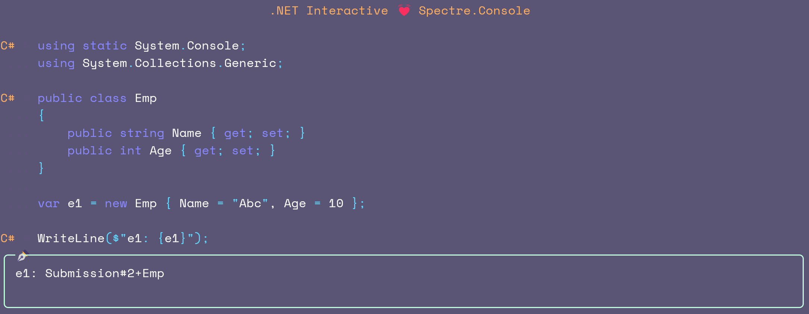
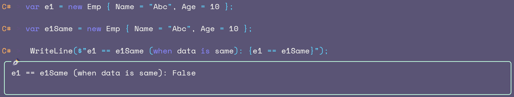
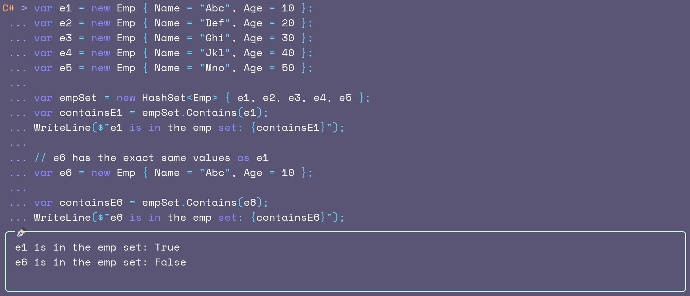
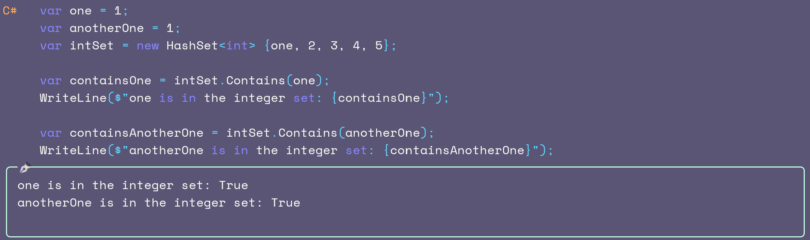
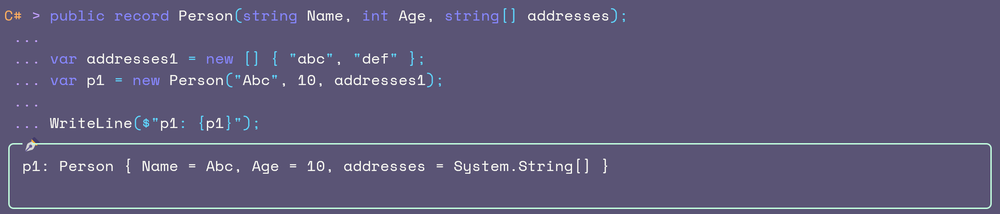
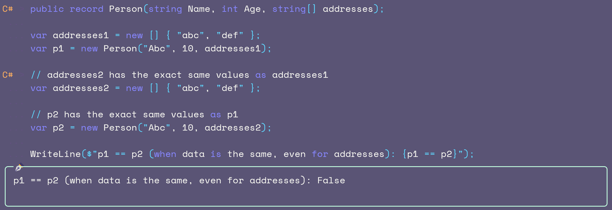

# C#

When modern languages like F# (or Scala, for JVM) are available, it's not ideal to continue to use C# (or Java on JVM). Sure, C# has been accumulating lots of F# features, but it can never match F#'s elegance and succinctness.

Still, if you have some doubts, then ask yourself these 3 simple questions and you might get enlightenment 😉

### Q1. Do you still want to implement ToString for all your classes in 2025?

### Q2. Do you still want to implement Equals for all your classes in 2025?

### Q3. Because of the above, do you still want Set inclusion to fail for all your classes in 2025?

### To refresh your memory, this is how a Set for integers behaves -

## But C# has records now

### Sorry to disappoint you 😧 (fails for ToString)

### Can't help 😬 (fails for Equals too)

## Why do the 2 sets behave differently? And, is this a problem?

Yes, because the **more important** part is the **value equality**, and not the *reference equality*.

For example, suppose you have inserted employee data from your Microsoft Active Directory (AD) into the database (for whatever reason), and at a future point in time, you again want to sync the database with the current data from the AD, you need the ability to **compare values** and *not references*.

Additionally, you have now seen, that C# records are not an answer. **At least, not yet.**

### Q4. OK, so should you replace every single line of C# code with F#?

A4. No, that is not possible, but you can at least start using [F#](https://fsharp.org/) **for your core business logic** and you can **always write tests** in F# ☺️.

### Q5. So, is C# useless then?

A5. Again, no! Keep using it for user interfaces and interacting with databases (Entity Framework etc.). This is what is called the Imperative <-> Functional (core) <-> Imperative (or the **OO <-> FP <-> OO**) sandwich.

And, since you are already using C#, please go full-stack C# and start using either [Avalonia UI](https://avaloniaui.net/), or [Uno Platform](https://platform.uno/), or [OpenSilver](https://opensilver.net/) for the UI layer, instead of Angular, React or any other JS / TS framework. If for any unavoidable reason, you have to stick to a JS / TS framework, go with either [Solid JS](https://www.solidjs.com/) or [Svelte](https://svelte.dev/).

To avoid all the above problems, please use [F#](https://fsharp.org/). If you don't want to replace your entire C# codebase, then at least start using F# **for your code business logic** and you can **always write tests** in F# ☺️.

## Conclusion

C# is an old (OO) language and no matter how many features it accumulates, it cannot match F#, so **start adopting F# for more and more pieces of your code and you'll have to write way less code, which will have way less bugs leading to increased productivity of your teams**.
